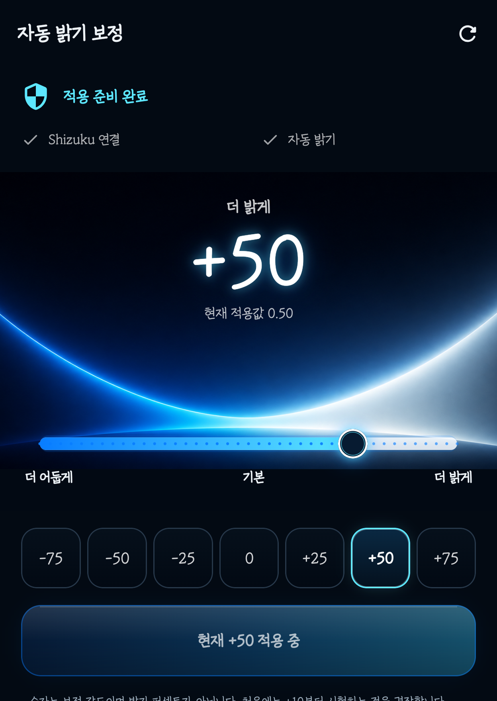
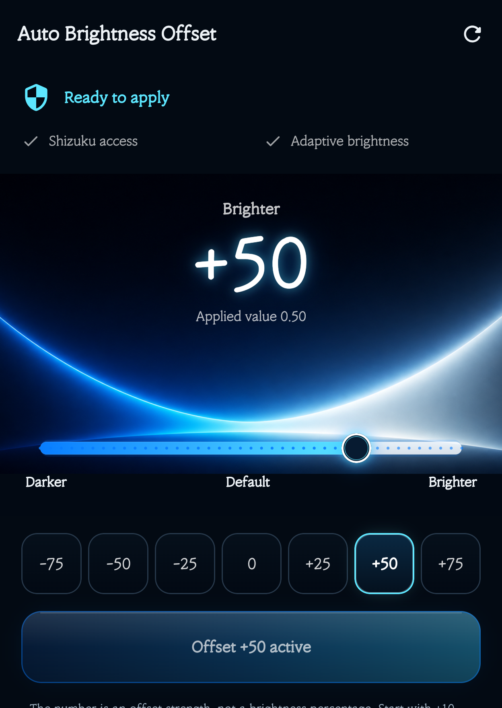

# Auto Brightness Offset | 자동 밝기 보정

[](https://github.com/fullmetalsonic/galaxy-auto-brightness-offset/actions/workflows/android.yml)

[한국어](#한국어) · [English](#english) · [한국어 상세 설명서](docs/USER_GUIDE_KO.md) · [English guide](docs/USER_GUIDE_EN.md) · [Download v1.4.0](https://github.com/fullmetalsonic/galaxy-auto-brightness-offset/releases/tag/v1.4.0)

<p align="center">
  
  
</p>

> 실제 Galaxy Z Fold8 화면입니다. 공개 이미지에서는 통신사·시간·알림·배터리·내비게이션 표시가 있는 시스템 영역만 잘랐습니다.<br>
> These are real Galaxy Z Fold8 captures. Only the system status and navigation bars were cropped for privacy.

## 한국어

삼성 갤럭시의 **자동 밝기를 계속 사용하면서**, 시스템이 주변 조도에 따라 정한 밝기를 일정한 성향으로 더 밝거나 어둡게 보정하는 로컬 Android 앱입니다.

### 이런 경우에 적합합니다

- 자동 밝기는 계속 사용하고 싶지만 화면이 항상 조금 어둡게 느껴지는 경우
- 자동 밝기가 필요 이상으로 밝아 눈이 피로하거나 배터리 소모가 신경 쓰이는 경우
- 사생활 보호필름(프라이버시 필름), 저반사 필름 또는 강화유리를 붙인 뒤 화면이 더 어둡게 느껴지는 경우
- 갤럭시 Z 폴드·삼성 갤럭시에서 주변 밝기가 바뀔 때마다 밝기 슬라이더를 직접 조절하고 싶지 않은 경우
- 시스템 자동 밝기의 변화 방식은 유지하면서 항상 일정한 밝기 성향만 더하거나 빼고 싶은 경우

이 앱은 보호필름 자체의 투과율이나 시야각을 바꾸지 않습니다. 자동 밝기의 결과를 보정해 **체감상 어둡거나 밝은 화면을 조절**합니다.

### 다운로드

- APK: [AutoBrightnessOffset-v1.4.0-release.apk](https://github.com/fullmetalsonic/galaxy-auto-brightness-offset/releases/download/v1.4.0/AutoBrightnessOffset-v1.4.0-release.apk)
- 크기: `3,466,647 bytes`
- SHA-256: `7052CB8EC87544481D6CF9824F8B79D2243FBF901CB45246087814617D8931C9`
- 빌드·서명: R8 최적화 Release, Android Debug 인증서, APK Signature Scheme v2·v3

이 APK는 개인 테스트·사이드로드용 디버그 서명 빌드입니다. Google Play 배포용 서명 빌드는 아닙니다.

### 필수 준비

1. 삼성 갤럭시에서 `설정 → 디스플레이 → 자동 밝기`를 켭니다.
2. 공식 [Shizuku 다운로드 페이지](https://shizuku.rikka.app/download/)에서 Shizuku를 설치합니다.
3. 공식 [Shizuku 시작 안내](https://shizuku.rikka.app/guide/setup/)에 따라 서비스를 시작합니다.
4. 이 앱을 열고 Shizuku 권한을 허용합니다.
5. 처음에는 `+10`부터 시험합니다.

처음 설치하는 사람은 이미지가 포함된 [한국어 상세 설명서](docs/USER_GUIDE_KO.md)를 순서대로 따라가면 됩니다.

### 주요 기능

- 보정 범위 `-100~+100`, 5단계 간격
- 프리셋 `-75`, `-50`, `-25`, `0`, `+25`, `+50`, `+75`
- 주변 조도 변화에 따른 자동 재계산
- 화면 OFF 시 임시 밝기 해제, 화면 ON 시 재적용
- 앱에서 `원래 값 복원` 및 알림에서 `보정 해제`
- 시스템 언어에 따른 한국어·영어 UI
- 진단 정보 복사와 선택형 재부팅 후 재적용
- 인터넷·계정·광고·분석·개인정보 수집 없음

숫자는 화면 밝기 퍼센트가 아니라 **자동 밝기 곡선의 보정 강도**입니다. `0`을 적용하거나 `원래 값 복원`을 누르면 앱의 임시 보정이 해제되고 시스템 자동 밝기로 돌아갑니다.

### 작동 방식

1. 휴대폰 조도 센서에서 현재 lux를 읽습니다.
2. Shizuku 사용자 서비스로 삼성 자동 밝기 곡선의 현재 목표값을 조회합니다.
3. Android 계열의 감마 방식으로 선택한 보정 강도를 계산합니다.
4. 설정 DB나 자동 밝기 학습값을 바꾸지 않고 임시 디스플레이 밝기 API를 적용합니다.
5. 조도가 기준 범위를 벗어나면 다시 계산합니다.

### Fold8 실제 검증

| 시험 | 결과 |
|---|---|
| JVM 단위시험 | PASS, 13/13 |
| Android Lint | PASS |
| Debug APK 빌드 | PASS |
| R8·리소스 축소 Release 빌드 | PASS, unsigned |
| Fold8 커버 화면 UI | PASS, `1248 × 1972`, `420 dpi` |
| `0` 복원 | PASS, 실제 자동 밝기 약 `0.3340` |
| `+75` 적용 | PASS, 기본 `0.3294` → 실제 `0.6144` |
| `+50` 복귀 | PASS, 실제 `0.5267` |
| 아이콘 축소판 설치·표시 | PASS |
| 설치 APK와 기기 `base.apk` 해시 | PASS, 일치 |

삼성의 야외 고휘도, 발열 감광, 절전 모드, HDR 및 앱별 제한은 계속 우선합니다. One UI 업데이트나 다른 제조사에서는 삼성 전용 명령/API가 달라 동작하지 않을 수 있습니다.

## English

**Auto Brightness Offset** keeps Samsung adaptive brightness enabled while shifting its result consistently brighter or darker. It is a local Android utility built for Samsung Galaxy devices and physically tested on a Galaxy Z Fold8.

### Who this is for

- Samsung adaptive brightness always feels a little too dark, but you still want it enabled
- Auto brightness often feels too bright, causing eye strain or unnecessary battery use
- A privacy screen protector, privacy filter, anti-glare film, or tempered glass makes the display feel dimmer
- You use a Galaxy Z Fold or Samsung Galaxy and do not want to move the brightness slider whenever ambient light changes
- You want to preserve the system's adaptive behavior while adding a consistent brighter or darker bias

The app does not change a screen protector's light transmission or viewing angle. It compensates the adaptive-brightness result when the display **feels consistently too dim or too bright**.

### Download

- APK: [AutoBrightnessOffset-v1.4.0-release.apk](https://github.com/fullmetalsonic/galaxy-auto-brightness-offset/releases/download/v1.4.0/AutoBrightnessOffset-v1.4.0-release.apk)
- Size: `3,466,647 bytes`
- SHA-256: `7052CB8EC87544481D6CF9824F8B79D2243FBF901CB45246087814617D8931C9`
- Build/signature: R8-optimized Release, Android Debug certificate, APK Signature Scheme v2 and v3

This is a debug-signed sideload build for personal testing, not a Google Play production-signed package.

### Requirements and quick start

1. Enable `Settings → Display → Adaptive brightness` on the Samsung device.
2. Install Shizuku from the official [Shizuku download page](https://shizuku.rikka.app/download/).
3. Start its service using the official [Shizuku setup guide](https://shizuku.rikka.app/guide/setup/).
4. Open Auto Brightness Offset and grant its Shizuku permission.
5. Start with `+10`, then adjust gradually.

See the illustrated [English setup and user guide](docs/USER_GUIDE_EN.md) for every step.

### Features

- `-100` to `+100` compensation in 5-point steps
- Quick presets: `-75`, `-50`, `-25`, `0`, `+25`, `+50`, `+75`
- Automatic recalculation when ambient light changes
- Temporary override cleared while the screen is off and reapplied when it turns on
- Restore from the app or clear the offset from the management notification
- Korean UI on Korean systems and English UI on other locales
- Copyable diagnostics and optional reapply-after-reboot workflow
- No Internet permission, account, ads, analytics, or personal-data collection

The number is a **curve-offset strength**, not a brightness percentage. Applying `0` or choosing **Restore original** clears the app's temporary override and returns control to system adaptive brightness.

### How it works

The app reads ambient lux, queries Samsung's current adaptive-brightness target through a Shizuku user service, applies a gamma-style correction, and sends a temporary display-brightness override. It does not write the adaptive-brightness learning value.

Samsung outdoor boost, thermal dimming, power saving, HDR, and app-specific limits remain in control. Samsung's command output and private temporary-brightness API can change with One UI updates and may not work on other brands.

### 검색어 / Search keywords

- 한국어: **갤럭시 자동 밝기 어두움**, **삼성 자동 밝기 보정**, **자동 밝기 항상 어두움**, **자동 밝기 항상 밝음**, **사생활 보호필름 화면 어두움**, **프라이버시 필름 밝기**, **갤럭시 폴드 화면 밝기**
- English: **Samsung adaptive brightness too dark**, **Samsung auto brightness too bright**, **privacy screen protector dim display**, **Galaxy brightness offset**, **Galaxy Z Fold adaptive brightness**, **Shizuku brightness controller**, **One UI brightness adjustment**

## Documents

- [한국어 상세 설명서](docs/USER_GUIDE_KO.md)
- [English detailed guide](docs/USER_GUIDE_EN.md)
- [Document index / 문서 색인](docs/INDEX.md)
- [Privacy and permissions / 개인정보 및 권한](docs/PRIVACY.md)
- [v1.4.0 release notes](docs/RELEASE_NOTES_v1.4.0.md)
- [Fold8 device test plan](docs/DEVICE_TEST_PLAN.md)
- [Debug and regression ledger](docs/DEBUG_LEDGER.md)
- [Project history](docs/PROJECT_HISTORY.md)
- [Handover](HANDOVER.md)

## Build

```powershell
.\scripts\verify.ps1 -IncludeRelease
```

The script runs clean, JVM tests, Android Lint, Debug APK assembly, and an R8/resource-shrunk unsigned Release build. The public APK is that optimized Release output signed with the Android Debug certificate and then installed on the physical Fold8.

## License status

The repository is publicly viewable, but no open-source license has been selected. Public visibility alone does not grant reuse, redistribution, or modification rights beyond applicable law. Shizuku and other dependencies retain their own licenses.
