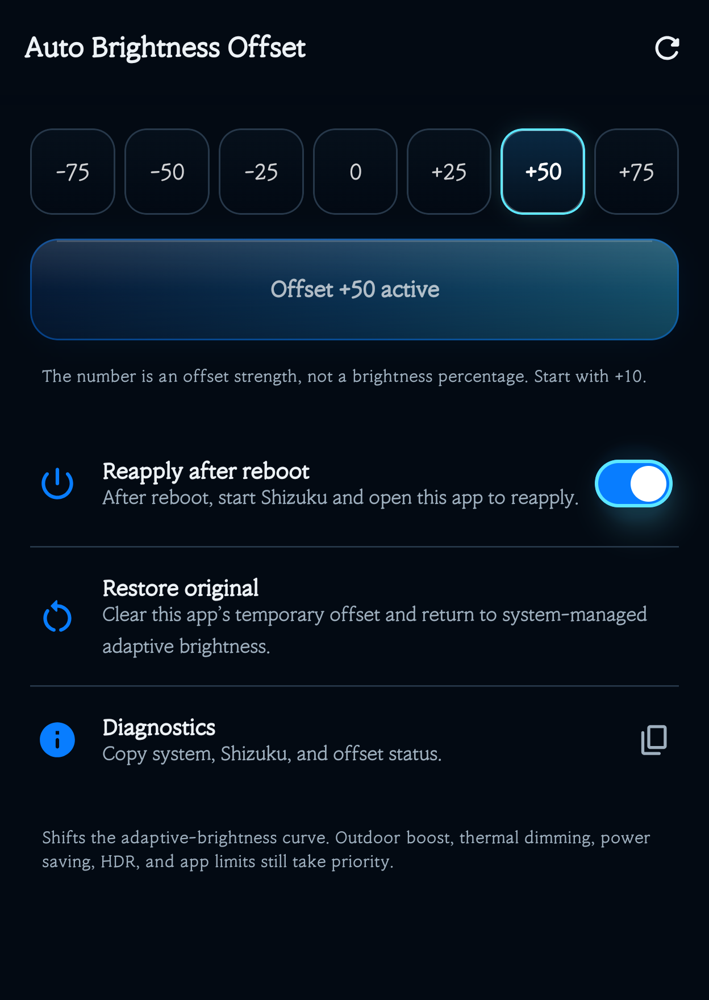

# Auto Brightness Offset v1.4.0 — Detailed Guide

[Back to README](../README.md) · [한국어 설명서](USER_GUIDE_KO.md) · [Download v1.4.0](https://github.com/fullmetalsonic/galaxy-auto-brightness-offset/releases/tag/v1.4.0)

This guide covers every setup and operating step for a first-time Samsung Galaxy user. Exact labels can vary slightly by One UI and Shizuku version.

## Stage 0 — Understand what the app does

This app does not disable adaptive brightness or hold the display at one fixed level. It shifts the result calculated by Samsung adaptive brightness.

- Positive values: brighter at the same ambient-light level
- Negative values: darker at the same ambient-light level
- `0`: clear the temporary app override and return to system adaptive brightness
- The number is an offset strength, not a display-brightness percentage

The app does not bundle root or an ADB server. It uses a user-approved connection to the official Shizuku app when calling protected display functions.

## Stage 1 — Check the requirements

You need:

- A Samsung Galaxy phone
- Android 11 or later recommended
- Internet access only to download Shizuku and the APK
- Samsung **Adaptive brightness** enabled
- The official Shizuku app
- The Auto Brightness Offset v1.4.0 APK

Android 11 and later can start Shizuku directly on the phone through wireless debugging. Android 10 and earlier require the computer ADB method.

## Stage 2 — Install Shizuku

1. Open the official [Shizuku download page](https://shizuku.rikka.app/download/).
2. Install it from a listed Google Play or official GitHub Release source.
3. Open Shizuku once after installation.

Avoid similarly named APKs from unofficial download sites. This guide is for the official `RikkaApps/Shizuku` app.

## Stage 3 — Enable Samsung Developer options

1. Open **Settings**.
2. Choose **About phone**.
3. Choose **Software information**.
4. Tap **Build number** seven times quickly.
5. Enter the screen-lock PIN or pattern.
6. Return to the main Settings page and verify that **Developer options** appears near the bottom.

Skip this stage if Developer options is already visible.

## Stage 4 — Pair and start Shizuku with wireless debugging

These steps apply to Android 11 and later.

1. Open **Settings → Developer options**.
2. Enable **Wireless debugging**. A current Wi-Fi connection may be required.
3. Return to Shizuku.
4. In **Start via wireless debugging**, choose **Pairing**.
5. In Android, select **Pair device with pairing code**.
6. Enter the displayed six-digit code in the Shizuku notification and submit it.
7. Return to Shizuku and tap **Start**.

Pairing is normally needed only once. Starting the service is required again after every phone reboot.


The Shizuku screenshot above follows the phone's system language. The button positions and flow are the same in English. A successful start shows a **Shizuku is running** status card.


### If Shizuku does not start

1. Turn Wireless debugging off and on again.
2. Return to Shizuku and tap Start.
3. If needed, remove the old pairing and repeat Stage 4.
4. Try another Wi-Fi network if a corporate or public network blocks local-device communication.

Official procedure: [Shizuku setup guide](https://shizuku.rikka.app/guide/setup/)

## Stage 5 — Android 10 or earlier / computer ADB method

Skip this stage on Android 11 and later.

1. Download the official [Android SDK Platform Tools](https://developer.android.com/tools/releases/platform-tools) on the computer.
2. Enable **USB debugging** in Developer options.
3. Connect the phone by USB and approve the phone's debugging prompt.
4. Run `adb devices` and confirm that the phone state is `device`.
5. Run the official Shizuku start command:

```text
adb shell sh /sdcard/Android/data/moe.shizuku.privileged.api/start.sh
```

6. Confirm the running state in the Shizuku app.

## Stage 6 — Install Auto Brightness Offset

1. Open the GitHub [v1.4.0 Release](https://github.com/fullmetalsonic/galaxy-auto-brightness-offset/releases/tag/v1.4.0).
2. Download `AutoBrightnessOffset-v1.4.0-release.apk`.
3. Open the download from the browser notification or **My Files → Downloads**.
4. If Android asks, temporarily allow **Install unknown apps** for that browser or My Files.
5. You may turn that permission off again after installation.

File verification:

- Size: `3,466,647 bytes`
- SHA-256: `7052CB8EC87544481D6CF9824F8B79D2243FBF901CB45246087814617D8931C9`
- Build/signature: R8-optimized Release, Android Debug certificate, APK Signature Scheme v2 and v3

This is a debug-signed personal-test package, not a Google Play production-signed build.

## Stage 7 — First launch and permissions

1. Verify that Shizuku is running first.
2. Open **Auto Brightness Offset**.
3. Allow the app in Shizuku's permission dialog.
4. Verify that the top status reads **Ready to apply**.
5. Verify that **Shizuku access** and **Adaptive brightness** both show a ready state.
6. Allow notifications when prompted. They show active management and provide a **Clear offset** action.


If you denied access accidentally, open Shizuku's authorized-app list and allow Auto Brightness Offset there.

## Stage 8 — Choose an offset

### Slider

- Range: `-100` to `+100`
- Step size: 5
- Left: darker
- Center `0`: system default
- Right: brighter

### Quick presets

Choose `-75`, `-50`, `-25`, `0`, `+25`, `+50`, or `+75` with one tap.

Start with a small value such as `+10` or `-10`. Values from `+75` to `+100` and `-75` to `-100` are intentionally strong.

## Stage 9 — Apply and verify

1. Select a value.
2. Tap **Apply selected offset**.
3. Confirm that the main button changes to **Offset +value active** or **Offset -value active**.
4. Check for the **Auto brightness offset active** notification.
5. Keep the phone in the same location and compare the display before and after applying.
6. When ambient light changes, the app reads Samsung's new adaptive target and recalculates the offset.

If the first change is subtle, move in 5- or 10-point steps. Samsung brightness animation and ambient-light stabilization can make the visual change feel slightly delayed.

## Stage 10 — Reapply after a reboot

**Reapply after reboot** remembers the last active offset. However, non-root Shizuku stops when the phone reboots.

After a reboot:

1. Open Shizuku.
2. Start Shizuku again through wireless debugging.
3. Open Auto Brightness Offset.
4. Confirm **Ready to apply** and the active value.

The offset cannot resume before Shizuku is running.

## Stage 11 — Restore the original behavior

Use any one of these methods:

- Select `0` and apply it
- Tap **Restore original** in the app
- Tap **Clear offset** in the management notification

Restoring clears the temporary display override and stops the management service, returning direct control to Samsung adaptive brightness.



## Stage 12 — Use Diagnostics

Tap **Diagnostics** to copy:

- App version
- Shizuku state
- Adaptive-brightness state
- Current and last offset
- Management state
- Reapply-after-reboot setting

The report is not designed to contain accounts, passwords, photos, or screen content. Review copied text yourself before sharing it in an issue.

## Stage 13 — Troubleshooting

| Symptom | Check | Action |
|---|---|---|
| Install Shizuku first | Shizuku is missing | Install it from the official download page |
| Start Shizuku first | Service is stopped | Enable wireless debugging and start Shizuku |
| Shizuku permission required | Access was denied | Allow the app in Shizuku's authorized-app list |
| Adaptive brightness required | Manual brightness is active | Enable Samsung Adaptive brightness |
| Difference is too small | Small value or changing ambient light | Compare `+25` and `+50` in the same location |
| Display is too bright or dark | Offset is too strong | Apply `0` or choose Restore original |
| No management notification | Notification permission blocked | Allow notifications in Android app info |
| Not active after reboot | Shizuku stopped at boot | Start Shizuku, then reopen the app |
| Wireless start fails | Pairing or network issue | Toggle wireless debugging and pair again |
| Failure after a One UI update | Private API may have changed | Copy Diagnostics and report an issue |

## Stage 14 — Uninstall and clean up

1. Tap **Restore original** first.
2. Confirm that the active-management notification disappears.
3. Uninstall Auto Brightness Offset from Android app info.
4. Stop or uninstall Shizuku only if no other apps need it.
5. Disable wireless and USB debugging if you no longer use Developer options.

## Stage 15 — Privacy, safety, and limitations

- The app has no Internet permission.
- It uses no account, ads, analytics, location, camera, microphone, or contacts.
- It stores only management state, the last offset, and the reapply-after-reboot choice.
- It does not save or transmit ambient-light history or screen content.
- Shizuku's own behavior and networking follow Shizuku's policies.
- Outdoor boost, thermal dimming, power saving, HDR, and app-specific limits remain higher priority.
- Samsung-specific commands and private temporary APIs may fail on other manufacturers or after a future One UI change.

See [Privacy and permissions](PRIVACY.md) for the exact permission inventory.

## Official references

- [Official Shizuku download](https://shizuku.rikka.app/download/)
- [Official Shizuku setup guide](https://shizuku.rikka.app/guide/setup/)
- [Official Shizuku GitHub](https://github.com/RikkaApps/Shizuku)
- [Official Shizuku API GitHub](https://github.com/RikkaApps/Shizuku-API)
- [Samsung Developer options guide](https://developer.samsung.com/health/data/guide/phone-developer-options.html)
- [Android hardware-device and wireless-debugging guide](https://developer.android.com/studio/run/device)
