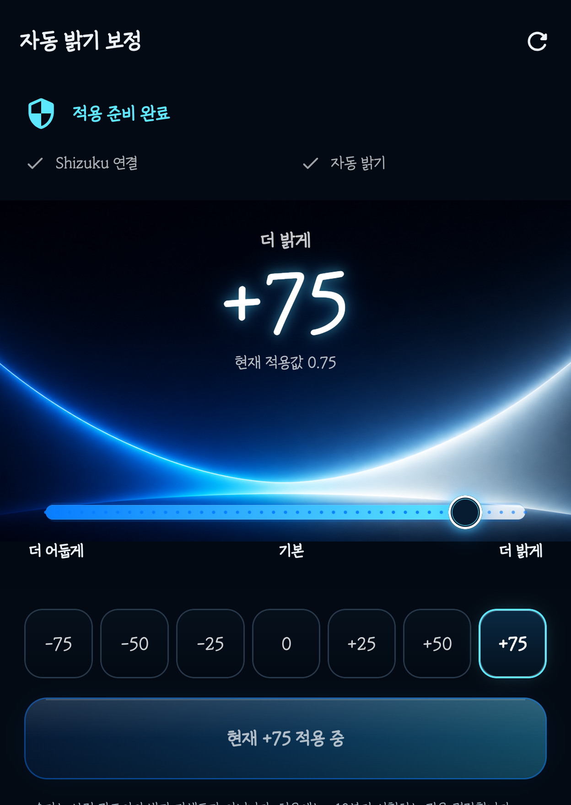
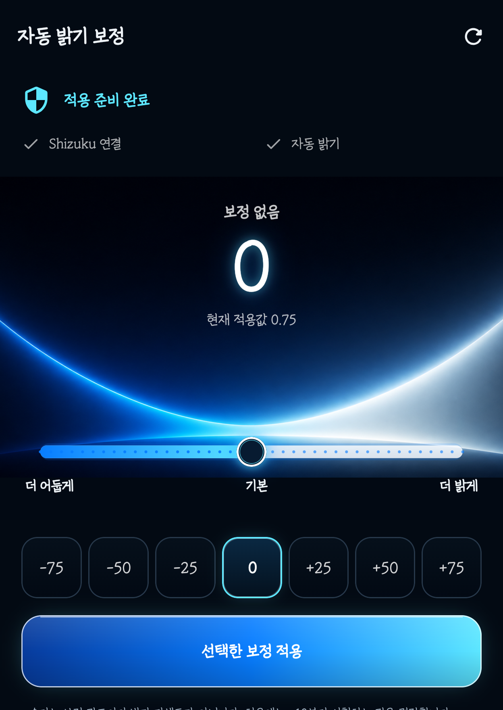
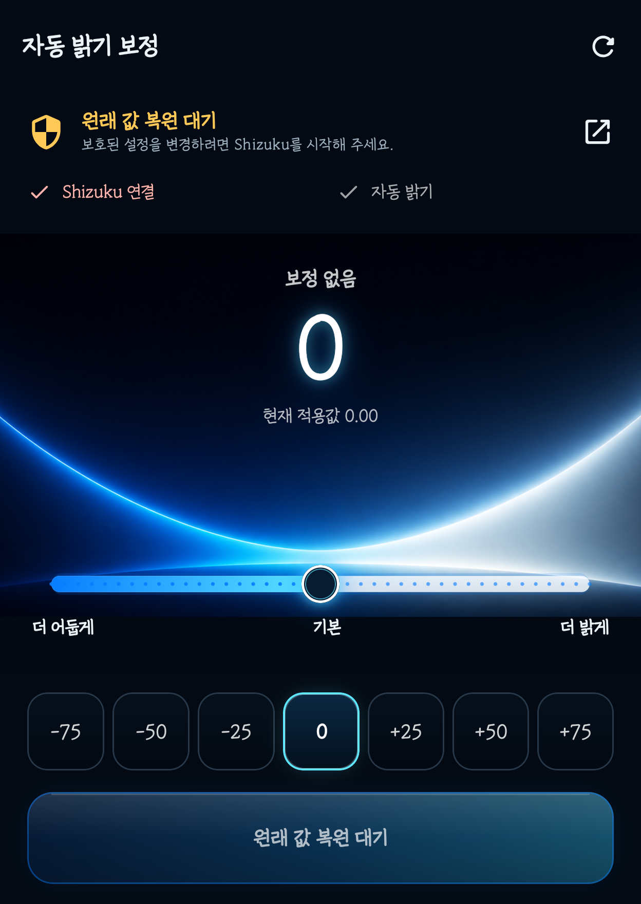
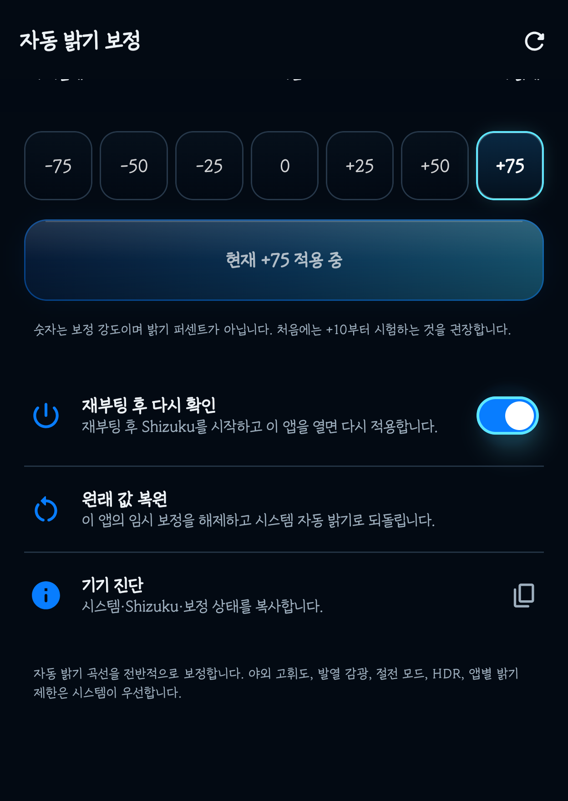

# 자동 밝기 보정 v1.4.1 상세 설명서

[README로 돌아가기](../README.md) · [English guide](USER_GUIDE_EN.md) · [v1.4.1 다운로드](https://github.com/fullmetalsonic/galaxy-auto-brightness-offset/releases/tag/v1.4.1)

이 문서는 삼성 갤럭시에서 Shizuku와 자동 밝기 보정 앱을 처음 설치하는 사람을 위한 단계별 설명서입니다. 화면 명칭은 One UI와 Shizuku 버전에 따라 조금 다를 수 있습니다.

## 0단계: 먼저 알아둘 점

이 앱은 자동 밝기를 끄고 고정 밝기를 만드는 앱이 아닙니다. 삼성의 자동 밝기가 계산한 결과를 기준으로 조금 더 밝게 또는 어둡게 보정합니다.

- `+` 값: 같은 주변 조도에서 더 밝게
- `-` 값: 같은 주변 조도에서 더 어둡게
- `0`: 앱의 임시 보정을 해제하고 시스템 자동 밝기로 복귀
- 숫자: 밝기 퍼센트가 아닌 보정 강도

앱 자체에는 루트나 ADB 서버가 들어 있지 않습니다. 보호된 디스플레이 기능을 호출할 때 공식 Shizuku 앱의 사용자 승인을 사용합니다.

## 1단계: 준비물 확인

필수 항목은 다음과 같습니다.

- Samsung Galaxy 스마트폰
- Android 11 이상 권장
- 인터넷 연결: Shizuku와 APK를 내려받을 때만 필요
- 삼성 `자동 밝기` 활성화
- 공식 Shizuku 앱
- Auto Brightness Offset v1.4.1 APK

Android 11 이상은 휴대폰만으로 무선 디버깅을 통해 Shizuku를 시작할 수 있습니다. Android 10 이하는 PC의 ADB 방식이 필요합니다.

## 2단계: Shizuku 설치

1. 공식 [Shizuku 다운로드 페이지](https://shizuku.rikka.app/download/)를 엽니다.
2. 안내된 Google Play 또는 공식 GitHub Release 경로에서 설치합니다.
3. 설치가 끝나면 Shizuku를 한 번 실행합니다.

앱 이름과 패키지명이 비슷한 비공식 APK를 임의 사이트에서 받지 마십시오. 이 설명서는 공식 `RikkaApps/Shizuku` 앱을 기준으로 합니다.

## 3단계: 삼성 개발자 옵션 켜기

1. 휴대폰 `설정`을 엽니다.
2. `휴대전화 정보`를 누릅니다.
3. `소프트웨어 정보`를 누릅니다.
4. `빌드번호`를 빠르게 7번 누릅니다.
5. 화면 잠금 PIN 또는 패턴을 입력합니다.
6. 설정 첫 화면으로 돌아가 맨 아래의 `개발자 옵션`이 생겼는지 확인합니다.

개발자 옵션이 이미 보인다면 이 단계는 건너뛰어도 됩니다.

## 4단계: 무선 디버깅으로 Shizuku 페어링

Android 11 이상 기준입니다.

1. `설정 → 개발자 옵션`으로 이동합니다.
2. `무선 디버깅`을 켭니다. 현재 Wi-Fi 네트워크 연결이 필요할 수 있습니다.
3. Shizuku 앱으로 돌아갑니다.
4. `무선 디버깅으로 시작` 영역에서 `페어링`을 누릅니다.
5. Android의 `페어링 코드로 기기 페어링`을 누릅니다.
6. 표시된 6자리 코드를 Shizuku 알림의 입력란에 넣고 전송합니다.
7. Shizuku로 돌아와 `시작`을 누릅니다.

페어링은 보통 한 번만 하면 됩니다. 서비스 시작은 재부팅할 때마다 다시 해야 합니다.


정상이라면 Shizuku 첫 화면에 `Shizuku가 실행 중입니다`와 같은 상태가 표시됩니다.


### 시작이 실패할 때

1. 개발자 옵션의 `무선 디버깅`을 껐다가 다시 켭니다.
2. Shizuku를 다시 열고 `시작`을 누릅니다.
3. 그래도 안 되면 기존 페어링을 삭제한 뒤 4단계를 다시 진행합니다.
4. 회사·공공 Wi-Fi처럼 기기 간 통신을 차단하는 네트워크에서는 다른 Wi-Fi를 사용합니다.

공식 절차: [Shizuku setup guide](https://shizuku.rikka.app/guide/setup/)

## 5단계: USB ADB로 Shizuku 시작하고 Wi-Fi 없이 사용

Android 11 이상에서도 집에서 PC로 Shizuku를 시작해 두면 야외에서 Wi-Fi 연결 없이 사용할 수 있습니다. 아래 순서는 Shizuku v13.6.0과 Galaxy Z Fold8에서 실제 확인했습니다.

1. PC에 공식 [Android SDK Platform Tools](https://developer.android.com/tools/releases/platform-tools)를 받습니다.
2. 휴대폰 개발자 옵션에서 `USB 디버깅`을 켭니다.
3. USB로 연결하고 휴대폰의 디버깅 허용 창을 승인합니다.
4. PC 터미널에서 `adb devices`를 실행해 `device` 상태인지 확인합니다.
5. 먼저 Shizuku 앱 또는 공식 안내에 표시된 현재 ADB 시작 명령을 실행합니다. 일반적으로 다음 명령이 제공됩니다.

```text
adb shell sh /sdcard/Android/data/moe.shizuku.privileged.api/start.sh
```

6. 위 경로를 찾지 못하는 최신 Shizuku에서는 PowerShell에서 설치된 실행 파일 경로를 조회해 시작할 수 있습니다.

```powershell
$line = adb shell dumpsys package moe.shizuku.privileged.api |
    Select-String "legacyNativeLibraryDir=" |
    Select-Object -First 1
$libDir = ($line.ToString().Trim() -split "=", 2)[1]
adb shell "$libDir/arm64/libshizuku.so"
```

7. `adb shell pidof shizuku_server`가 숫자 PID를 출력하는지 확인합니다.
8. Shizuku 앱에서도 실행 중 상태를 확인합니다.
9. `설정 → 애플리케이션 → Shizuku → 배터리`에서 `제한 없음`을 선택합니다.
10. 같은 방법으로 `자동 밝기 보정 → 배터리 → 제한 없음`을 선택합니다.
11. `설정 → 배터리 → 백그라운드 사용 제한 → 절전 상태로 전환하지 않을 앱`에 Shizuku와 자동 밝기 보정을 모두 추가합니다. One UI 버전에 따라 메뉴 이름이 조금 다를 수 있습니다.
12. USB 케이블을 빼고 Wi-Fi와 `무선 디버깅`을 꺼도 보정은 계속 동작합니다. Fold8 실기기 시험에서는 `USB 디버깅`은 켠 상태로 유지했습니다.

Fold8 One UI 9에서는 두 앱의 절전 제한을 해제한 뒤 Wi-Fi OFF 상태에서 화면을 켠 채 백그라운드 3분, 화면 잠금, 재점등 후 자동 재적용을 실제 확인했습니다. 이것은 해당 시험 결과이며 모든 One UI 버전에서 영구 동작을 보장한다는 뜻은 아닙니다.

중요한 제한:

- USB는 Shizuku를 **시작할 때만** 필요하며, 사용 중 계속 연결할 필요는 없습니다.
- Wi-Fi와 무선 디버깅도 시작 후에는 계속 켜 둘 필요가 없습니다.
- 삼성 절전 관리가 Shizuku 또는 이 앱을 동결하지 않도록 두 앱 모두 배터리 제한을 해제해야 합니다.
- Shizuku PID가 살아 있는데 앱에 `보정 일시 중지`가 보이면 Wi-Fi를 켜지 말고 **Shizuku 앱 열기 → 자동 밝기 보정 앱 열기** 순서로 실행해 연결을 다시 받습니다.
- 휴대폰을 재부팅하거나 Shizuku 서버가 종료되면 다시 시작해야 합니다.
- 야외에서 재시작하려면 PC, Raspberry Pi 같은 USB ADB 브리지 또는 루트 방식이 필요합니다.
- Shizuku 버전에 따라 시작 명령이 달라질 수 있으므로 공식 앱에 표시된 명령이 있으면 그것을 우선합니다.

## 6단계: Auto Brightness Offset APK 설치

1. GitHub [v1.4.1 Release](https://github.com/fullmetalsonic/galaxy-auto-brightness-offset/releases/tag/v1.4.1)를 엽니다.
2. `AutoBrightnessOffset-v1.4.1-release.apk`를 내려받습니다.
3. 다운로드 완료 알림이나 `내 파일 → 다운로드`에서 APK를 엽니다.
4. Android가 요구하면 현재 브라우저 또는 내 파일 앱의 `출처를 알 수 없는 앱 설치`를 이번 설치에 허용합니다.
5. 설치가 끝나면 해당 허용은 다시 꺼도 됩니다.

파일 검증값:

- 크기: `3,474,839 bytes`
- SHA-256: `91B5700052DECF3BCCBC67B17684CF90DF4B7C2955FCBD9A1AD1799DA472BBD0`
- 빌드·서명: R8 최적화 Release, Android Debug 인증서, APK Signature Scheme v2·v3

이 파일은 Google Play 배포 서명이 아닌 개인 테스트용 디버그 서명 APK입니다.

## 7단계: 첫 실행과 권한 허용

1. 먼저 Shizuku가 실행 중인지 확인합니다.
2. `자동 밝기 보정` 앱을 엽니다.
3. Shizuku가 표시한 앱 권한 요청에서 `허용`을 누릅니다.
4. 앱 상단이 `적용 준비 완료`인지 확인합니다.
5. `Shizuku 연결`과 `자동 밝기` 옆에 정상 표시가 있는지 확인합니다.
6. 알림 권한 창이 나오면 허용합니다. 보정 작동 중 상태와 `보정 해제` 버튼을 표시하는 데 사용됩니다.



권한을 잘못 거부했다면 Shizuku 앱의 `승인된 애플리케이션`에서 자동 밝기 보정을 찾아 다시 허용합니다.

## 8단계: 보정값 선택

### 슬라이더

- 범위: `-100~+100`
- 간격: 5
- 왼쪽: 더 어둡게
- 가운데 `0`: 시스템 기본
- 오른쪽: 더 밝게

### 빠른 프리셋

`-75`, `-50`, `-25`, `0`, `+25`, `+50`, `+75`를 한 번 눌러 선택할 수 있습니다.



처음에는 `+10` 또는 `-10`처럼 작은 값부터 시험하십시오. `+75~+100`과 `-75~-100`은 변화가 매우 큽니다.

## 9단계: 적용과 확인

1. 원하는 값을 선택합니다.
2. `선택한 보정 적용`을 누릅니다.
3. 버튼 문구가 `현재 +값 적용 중` 또는 `현재 -값 적용 중`으로 바뀌는지 확인합니다.
4. 알림창에 `자동 밝기 보정 작동 중` 알림이 있는지 확인합니다.
5. 휴대폰을 같은 위치에 둔 채 보정 전후의 체감 밝기를 비교합니다.
6. 주변 조도가 바뀌면 앱이 삼성 기본 자동 밝기 목표를 다시 읽고 보정합니다.

즉시 변화가 작게 느껴지면 5~10씩 올리거나 내립니다. 삼성의 밝기 애니메이션과 조도 안정화 때문에 약간 늦게 느껴질 수 있습니다.

## 10단계: 재부팅 후 다시 적용

`재부팅 후 다시 확인`을 켜면 앱이 마지막 보정값을 기억합니다. 그러나 비루트 Shizuku 서비스는 휴대폰을 재부팅하면 중지됩니다.

재부팅 후 순서:

1. Shizuku를 엽니다.
2. 무선 디버깅으로 Shizuku를 다시 시작합니다.
3. 자동 밝기 보정 앱을 엽니다.
4. 상단 `적용 준비 완료`와 현재 적용값을 확인합니다.

Shizuku를 시작하지 않으면 보정은 자동으로 살아나지 않습니다.

## 11단계: 원래 값 복원과 중지

다음 세 방법 중 하나를 사용합니다.

- 앱에서 `0`을 선택하고 적용
- 앱 아래쪽의 `원래 값 복원`
- 관리 알림의 `보정 해제`

복원하면 임시 밝기 오버라이드와 관리 서비스가 해제되고 삼성 자동 밝기가 다시 직접 제어합니다.

Shizuku가 꺼진 동안 복원을 누르면 앱은 `원래 값 복원 대기`로 전환합니다. 이때 Shizuku를 시작하고 앱을 한 번 열면 임시 보정을 자동으로 해제합니다.





## 12단계: 진단 정보 사용

`기기 진단`을 누르면 다음 상태를 클립보드에 복사할 수 있습니다.

- 앱 버전
- Shizuku 상태
- 자동 밝기 상태
- 현재/마지막 보정값
- 보정 관리 여부
- 재부팅 후 재적용 설정
- 원래 값 복원 대기 여부

오류를 신고할 때 비밀번호, 계정, 사진 같은 개인정보는 포함되지 않습니다. 그래도 공유 전에는 복사된 문장을 직접 확인하십시오.

## 13단계: 문제 해결

| 증상 | 확인 | 조치 |
|---|---|---|
| `Shizuku를 먼저 설치` | Shizuku 앱 미설치 | 공식 다운로드 페이지에서 설치 |
| `Shizuku를 먼저 시작` | 서비스가 꺼짐 | 무선 디버깅 또는 USB ADB로 Shizuku 시작 후 앱 열기 |
| `보정 일시 중지` | 사용 중 Shizuku 서버 종료 | Shizuku 시작 후 앱을 한 번 열어 마지막 값 재적용 |
| `원래 값 복원 대기` | 연결이 끊긴 상태에서 복원 요청 | Shizuku 시작 후 앱을 열어 자동 복원 완료 확인 |
| Shizuku 권한 필요 | 앱 권한 거부 | Shizuku의 승인된 앱에서 허용 |
| 자동 밝기 필요 | 수동 밝기 사용 중 | 삼성 설정에서 자동 밝기 켜기 |
| 적용했는데 차이가 작음 | 값이 작거나 주변 조도가 변함 | 같은 위치에서 `+25`, `+50`처럼 단계적으로 비교 |
| 밝기가 너무 밝거나 어두움 | 보정값 과다 | `0` 적용 또는 원래 값 복원 |
| 알림이 안 보임 | 알림 권한 차단 | Android 앱 정보에서 알림 허용 |
| 재부팅 후 작동 안 함 | Shizuku가 중지됨 | Shizuku 시작 후 앱 다시 열기 |
| 무선 디버깅 시작 실패 | 페어링/네트워크 문제 | 무선 디버깅 재시작 후 재페어링 |
| Wi-Fi를 끈 뒤 2~3분 후 보정이 멈춤 | 삼성 절전 관리가 Shizuku Binder 또는 앱을 동결 | 두 앱을 `배터리 제한 없음`과 `절전 상태로 전환하지 않을 앱`에 추가 |
| Shizuku는 실행 중인데 `보정 일시 중지` | 앱이 Shizuku Binder를 다시 받지 못함 | Wi-Fi 없이 Shizuku 앱을 연 뒤 자동 밝기 보정 앱 열기 |
| 야외에서 Wi-Fi 없음 | USB로 미리 시작하지 않음 | 출발 전 USB ADB로 Shizuku 시작하고 두 앱의 절전 제한을 해제한 뒤 재부팅하지 않기 |
| One UI 업데이트 후 실패 | 비공개 API 변경 가능 | `기기 진단` 복사 후 Issue에 보고 |

## 14단계: 삭제와 정리

1. 먼저 앱에서 `원래 값 복원`을 누릅니다.
2. `원래 값 복원 대기`가 보이면 Shizuku를 시작하고 앱을 다시 열어 복원을 완료합니다.
3. 알림이 사라졌는지 확인합니다.
4. Android 앱 정보에서 자동 밝기 보정을 삭제합니다.
5. 다른 앱에서 Shizuku를 쓰지 않는다면 Shizuku도 중지하거나 삭제할 수 있습니다.
6. 개발자 옵션이 필요 없으면 무선 디버깅과 USB 디버깅을 끕니다.

## 15단계: 개인정보·안전·한계

- 앱에는 인터넷 권한이 없습니다.
- 계정, 광고, 분석, 위치, 카메라, 마이크, 연락처를 사용하지 않습니다.
- 저장하는 값은 관리 여부, 마지막 보정 강도, 재부팅 후 재적용 선택뿐입니다.
- 조도 센서 이력이나 화면 내용은 저장·전송하지 않습니다.
- Shizuku 앱의 동작과 네트워크 정책은 Shizuku의 정책을 따릅니다.
- 두 앱을 배터리 제한에서 제외하면 Android가 백그라운드 실행을 더 오래 허용하므로 기본 설정보다 배터리를 더 사용할 수 있습니다.
- 야외 고휘도, 발열 감광, 절전 모드, HDR, 앱별 밝기 제한은 시스템이 우선합니다.
- 삼성 전용 명령과 비공개 임시 API를 사용하므로 다른 제조사나 향후 One UI에서 실패할 수 있습니다.

자세한 권한 목록은 [개인정보 및 권한 문서](PRIVACY.md)를 참고하십시오.

## 공식 참고 링크

- [Shizuku 공식 다운로드](https://shizuku.rikka.app/download/)
- [Shizuku 공식 시작 안내](https://shizuku.rikka.app/guide/setup/)
- [Shizuku 공식 GitHub](https://github.com/RikkaApps/Shizuku)
- [Shizuku API 공식 GitHub](https://github.com/RikkaApps/Shizuku-API)
- [Samsung 개발자 옵션 안내](https://developer.samsung.com/health/data/guide/phone-developer-options.html)
- [Android 실제 기기·무선 디버깅 안내](https://developer.android.com/studio/run/device)
